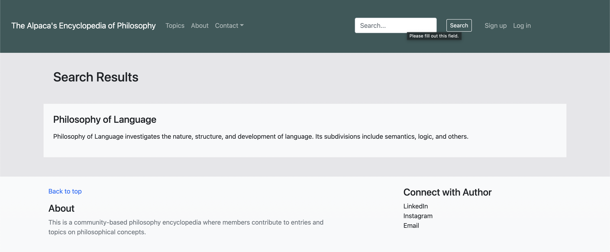

# Philosophy Wikipedia
A community-based philosophy encyclopedia where members contribute to entries and topics on philosophical concepts.
## Features
- Allow user to create, edit, and delete topics and entries of philosophy, given well-defined user access to perform those actions.

    

- Have a search function to let user search for any topic based on keyword in the topic's name or description.

    

- Enable user to sign up, log in, and log out, based on which a series of access to private content and action access are defined.

    

## Installment
To begin with, clone the project.
```
git clone https://github.com/RiddleHe/philos_pedia
```
After that, in the main directory, set up and activate a virtual environment to harbor the dependencies.
```
python3 -m venv ll_env
source ll_env/bin/activate
```
When the virtual environment is set up, install the dependencies.
```
pip install Django, django-bootstrap-v5
```
Then, in the main directory, run the server to load the web application, and now you can interact with it.
```
quiz % python3 manage.py runserver
```
## Technologies
*Using Python, Django, HTML, and Bootstrap*
- Built a search function that takes in POST request data and queries through the database to find match class instances.
- Used different Django ModelForms and user authentication forms to achieve a variety of user actions including editing, creation, and signing up.
